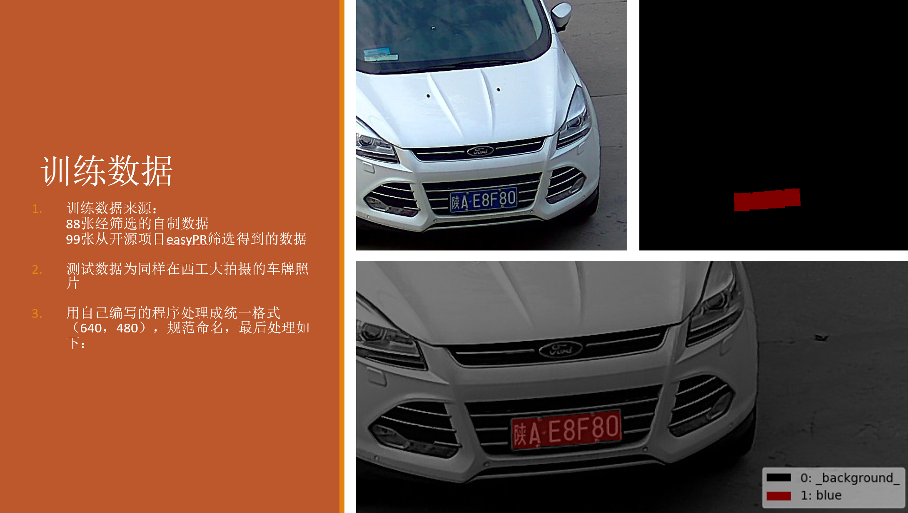
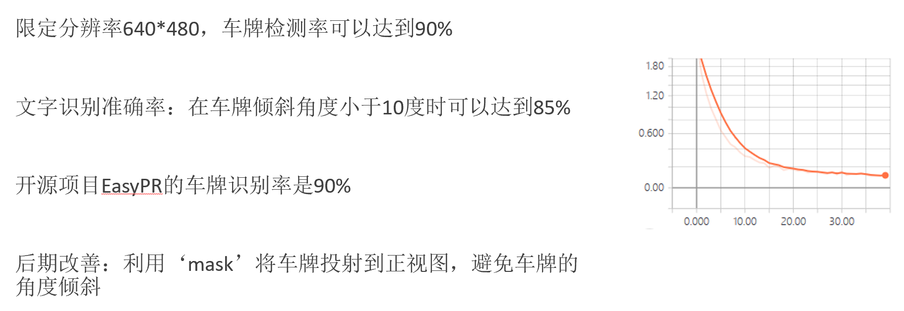

# 国内车牌识别系统LPRSv1.0
[TOC]

## 1. 项目依赖的技术

- 框架
  - TensorFlow-gpu 1.12.0
  - Keras
- IDE
  - PyCharm
- 工具
  - Pyqt5 5.11.3
  - OpenCV 3.4.0
  - Python 3.6
  - Tensorboard
  - Labelme and Labelme_json_to_dataset
  - 百度文字识别SDK
  - 自己编写的数据处理工具

## 2. 车牌识别流程

## 3. 训练数据

## 4. 模型效果及对比

## 5. demo

### 5.1 车牌识别demo

<iframe width="560" height="315" src="https://www.youtube.com/embed/hl3dR3F_fTw" frameborder="0" allow="accelerometer; autoplay; encrypted-media; gyroscope; picture-in-picture" allowfullscreen></iframe>

### 5.2 训练数据demo

<iframe width="560" height="315" src="https://www.youtube.com/embed/ejMba90SIZU" frameborder="0" allow="accelerometer; autoplay; encrypted-media; gyroscope; picture-in-picture" allowfullscreen></iframe>

